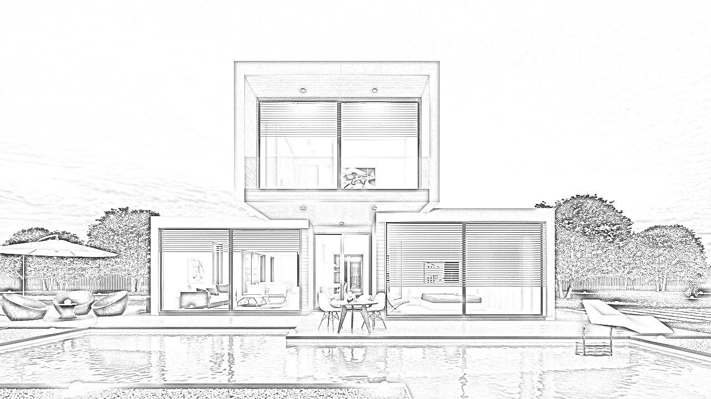
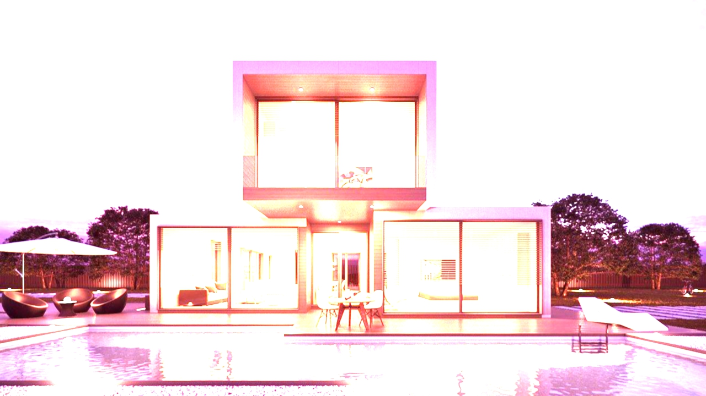
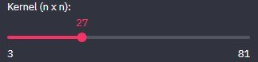
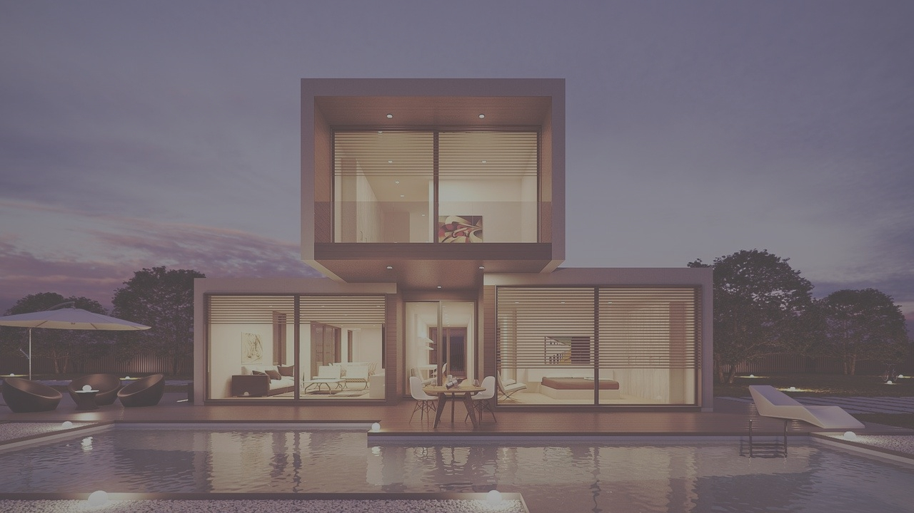
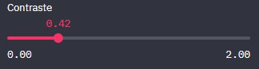

# Web app para processamento de imagens com OpenCV

Aplicativo de processamento digital de imagens usando o pacote [OpenCV](https://opencv.org) do Python com interface Web desenvolvida com [Streamlit](https://streamlit.io).

É possível ver os efeitos aplicados em uma imagem default como também fazer upload de uma imagem própria em seu computador e aplicar os filtros.

## Filtros

### Canny edges

Esse filtro geralmente é utilizado em etapas intermediárias do processamento de imagens para detecção de objetos. Como uma forma simplista de explicar sua função podemos dizer que o efeito Canny remove boa parte dos ruídos (informações desenecessárias) em uma imagem e deixa apenas as bordas, facilitando assim o processo de detecção de objetos.

Exemplo:

Imagem original (que será usada em todos os exemplos abaixo):


Imagem com efeito Canny:


A biblioteca OpenCV facilita a aplicação desse filtro, sendo possível implementá-lo com uma única linha de código:

```python
canny_img = cv2.Canny(blurred_img, min_val, max_val)
```

Na maior parte das vezes o desafio é ajustar os parâmetros dessa função: os limites de histerese mínimo e máximo. Isso porque o ajuste desse parâmetros depende da imagem que está sendo utilizada e não há uma fórmula que funcione para todas as imagens. Pensando nisso, esse aplicativo permite o ajuste manual desse parâmetros e a visualização do resultado da aplicação do filtro na imagem.

Ajuste dos parâmtros de histerese:


Para saber mais sobre a função Canny do OpenCV recomendo a leitura da documentação, que possui uma explicação bem didática e ilustrativa, acesse clicando [aqui](https://docs.opencv.org/3.4/da/d22/tutorial_py_canny.html).


### Sketch

Esse filtro deixa a foto semelhante a um desenho a lápis, e é muito utilizado nas redes sociais.

A seguir temos a aplicação desse filtro em uma imagem:



Esse filtro é um pouco mais complicado de aplicar, pois é resultado de algumas operações aplicadas e depois combinadas para gerar o resultado que vemos.

1. A imagem é convertida para *grayscale* (preto e branco)

```python
gray_img = cv2.cvtColor(converted_img, cv2.COLOR_RGB2GRAY)
```

2. Os pixels da imagem em *grayscale* são invertidos. Isso é feito substituindo o valor do pixel pelo módulo da subtração do maior valor da escala (no caso de pixels 255) pelo valor original do pixel

```python
inv_gray_img = 255 - gray_img
```

3. Na imagem resultante da etapa anterior é aplicado o filtro Gaussian Blur (que deixa a imagem "embaçada"), isso é feita com a função fornecida pela própria biblioteca OpenCV

```python
blur_img = cv2.GaussianBlur(inv_gray_img, (21, 21), 0, 0)
```

4. Nessa etapa combinamos a imagem resultante da etapa 1 (imagem em *grayscale*) com o inverso da imagem obtida na etapa 3. Usamos a função ``.divide()`` da biblioteca OpenCV para combinar as duas imagens

```python
sketch_img = cv2.divide(gray_img, 255 - blur_img, scale=256)
```

E como resultado obtemos um efeito semelhante a um desenho feito a lápis.

### Sépia

Para aplicar o filtro que dá um efeito de sépia na imagem utilizamos a função ``cv2.filter2D()`` que recebe como parâmetros a imagem onde o kernel (uma matriz de números que será multiplicada pela matriz de pixels da imagem) será aplicado, a profundidade e o próprio kernel (matriz):

```python
converted_img = np.array(default_img.convert('RGB'))
            kernel = np.array([[0.272, 0.534, 0.131],
                               [0.349, 0.686, 0.168],
                               [0.393, 0.769, 0.189]])
            output_img = cv2.filter2D(converted_img, -1, kernel)
            img.image(output_img)
```

O interessante é que é possível obter diversos efeitos diferentes variando os valores do kernel.

O resultado é visto na imagem abaixo:



### Gaussian Blur

A função ``cv2.GaussianBlur()`` do OpenCV aplica esse filtro nas imagens. O que define o quanto a imagem será "embaçada" é o tamanho do kernel que passamos para a função (o kernel é uma matriz e passamos para a função suas medidas, por exemplo: matriz 3x3 então passaremos (3, 3)).

```python
blurred_img = cv2.GaussianBlur(converted_img, (k_size, k_size), 0)
```

É importante ressaltar que o kernel deve ser quandrado (n, n) e sempre um número ímpar, por é necessário que haja um pixel no centro do kernel.

A imagem com o filtro aplicado fica da seguinte forma:


Esse web app ainda permite que sejam feitos ajustes no tamanho do kernel passado para a função através de um slider:



### Contraste

Para ajustar o contraste da imagem foi utilizado o módulo *ImageEnhance* da biblioteca [**PIL** (**P**ithon **I**maging **L**ibrary)](https://pypi.org/project/Pillow/). Primeiro é criado um objeto *enhancer* a partir da imagem, depois, a partir do objeto criado, chamamos a função ``.enhance()`` passando como argumento a intensidade do contraste e como retorno obtem-se a imagem:

```python
enhancer = ImageEnhance.Contrast(default_img)
output_img = enhancer.enhance(intensity)
img.image(output_img)
```

Exemplo de uma imagem com baixo contraste:



A aplicação também permite que o valor do contraste aplicado seja ajustado:

